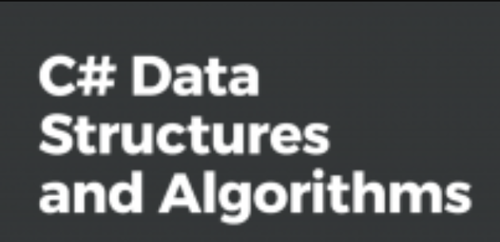

<a name="readme-top"></a>


<div align="center">
  <!-- You are encouraged to replace this logo with your own! Otherwise you can also remove it. -->
  
  <br/>

  <h3><b>Microverse README Template</b></h3>

</div>

<!-- TABLE OF CONTENTS -->

# 📗 Table of Contents

- [📖 About the Project](#about-project)
  - [🛠 Built With](#built-with)
    - [Tech Stack](#tech-stack)
    - [Key Features](#key-features)
  - [🚀 Live Demo](#live-demo)
- [💻 Getting Started](#getting-started)
  - [Setup](#setup)
  - [Prerequisites](#prerequisites)
  - [Install](#install)
  - [Usage](#usage)
  - [Run tests](#run-tests)
  - [Deployment](#triangular_flag_on_post-deployment)
- [👥 Author](#author)
- [🔭 Future Features](#future-features)
- [🤝 Contributing](#contributing)
- [⭐️ Show your support](#support)
- [🙏 Acknowledgements](#acknowledgements)
- [❓ FAQ (OPTIONAL)](#faq)
- [📝 License](#license)

<!-- PROJECT DESCRIPTION -->

# 📖 [DSA] <a name="about-project"></a>

**[DSA]** is a C# solution to prepare the most common interview tests for data structures and algorithms.

1. Graph
   - Breadth First Search(BFS): 
     </br>
     
   - Deep Fist Search
   </br>
     
2. Linked List
3. Dynamic Programming
4. Sorting And Searching
5. Tree / Binary Search Tree
6. Number Theory
7. BIT Manipulation
8. String / Array

## 🛠 Built With <a name="built-with"></a>
C#.NET 
### Tech Stack <a name="tech-stack"></a>

> Describe the tech stack and include only the relevant sections that apply to your project.

<details>
  <summary>Class Library</summary>
  <ul>
    <li>ClassLibrary Project</li>
  </ul>
</details>

<details>
  <summary>Tests</summary>
  <ul>
    <li>xUnit Test Project</li>
  </ul>
</details>
<!-- Features -->

### Key Features <a name="key-features"></a>

- **[Big-O Notation]**
[Big-O freecodecamp](https://www.freecodecamp.org/news/big-o-notation-why-it-matters-and-why-it-doesnt-1674cfa8a23c)
Big O notation is one of the most fundamental tools for computer scientists to analyze the cost of an algorithm. 
Big O notation describes the complexity of your code using algebraic terms.

To understand what Big O notation is, we can take a look at a typical example, O(n²), which is usually pronounced “Big O squared”. 
The letter “n” here represents the input size, and the function “g(n) = n²” inside the “O()” gives us an idea of how complex 
the algorithm is with respect to the input size.

A typical algorithm that has the complexity of O(n²) would be the selection sort algorithm:

```
SelectionSort(List) {
  for(i from 0 to List.Length) {
    SmallestElement = List[i]
    for(j from i to List.Length) {
      if(SmallestElement > List[j]) {
        SmallestElement = List[j]
      }
    }
    Swap(List[i], SmallestElement)
  }
}
```


- **[Data Structures]**
- **[Algorithms]**
- **[Unit Testing]**

<p align="right">(<a href="#readme-top">back to top</a>)</p>

<!-- LIVE DEMO 

## 🚀 Live Demo <a name="live-demo"></a>

- [Live Demo Link](https://google.com)

<p align="right">(<a href="#readme-top">back to top</a>)</p>
-->

## 💻 Getting Started <a name="getting-started"></a>

> Describe how a new developer could make use of your project.

To get a local copy up and running, follow these steps.

### Prerequisites

In order to run this project you need:

<!--
Example command:

```sh
 gem install rails
```
 -->

### Setup

Clone this repository to your desired folder:

<!--
Example commands:

```sh
  cd my-folder
  git clone git@github.com:myaccount/my-project.git
```
--->

### Install

Install this project with:

<!--
Example command:

```sh
  cd my-project
  gem install
```
--->

### Usage

To run the project, execute the following command:

<!--
Example command:

```sh
  rails server
```
--->

### Run tests

To run tests, run the following command:

<!--
Example command:

```sh
  bin/rails test test/models/article_test.rb
```
--->

### Deployment

You can deploy this project using:

<!--
Example:

```sh

```
 -->

<p align="right">(<a href="#readme-top">back to top</a>)</p>

<!-- AUTHORS -->

## 👤 Author <a name="author"></a>

👤 **Elio Cortés**

- GitHub: [@NeckerFree](https://github.com/NeckerFree)
- Twitter: [@ElioCortesM](https://twitter.com/ElioCortesM)
- LinkedIn: [elionelsoncortes](https://www.linkedin.com/in/elionelsoncortes/)

<p align="right">(<a href="#readme-top">back to top</a>)</p>

<!-- FUTURE FEATURES -->

## 🔭 Future Features <a name="future-features"></a>

> Describe 1 - 3 features you will add to the project.

- [ ] **[new_feature_1]**
- [ ] **[new_feature_2]**
- [ ] **[new_feature_3]**

<p align="right">(<a href="#readme-top">back to top</a>)</p>

<!-- CONTRIBUTING -->

## 🤝 Contributing <a name="contributing"></a>

Contributions, issues, and feature requests are welcome!

Feel free to check the [issues page](../../issues/).

<p align="right">(<a href="#readme-top">back to top</a>)</p>

<!-- SUPPORT -->

## ⭐️ Show your support <a name="support"></a>

> Write a message to encourage readers to support your project

If you like this project...

<p align="right">(<a href="#readme-top">back to top</a>)</p>

<!-- ACKNOWLEDGEMENTS -->

## 🙏 Acknowledgments <a name="acknowledgements"></a>

> Give credit to everyone who inspired your codebase.

I would like to thank...

<p align="right">(<a href="#readme-top">back to top</a>)</p>

<!-- FAQ (optional) -->

## ❓ FAQ (OPTIONAL) <a name="faq"></a>

- **Related documentation**
[GH Algorithms](https://github.com/TheAlgorithms/C-Sharp)
[Top 10 algorithms in Interview Questions](https://www.geeksforgeeks.org/top-10-algorithms-in-interview-questions)

- **[Question_2]**

  - [Answer_2]

<p align="right">(<a href="#readme-top">back to top</a>)</p>

<!-- LICENSE -->

## 📝 License <a name="license"></a>

This project is [MIT](./LICENSE) licensed.

_NOTE: we recommend using the [MIT license](https://choosealicense.com/licenses/mit/) - you can set it up quickly by [using templates available on GitHub](https://docs.github.com/en/communities/setting-up-your-project-for-healthy-contributions/adding-a-license-to-a-repository). You can also use [any other license](https://choosealicense.com/licenses/) if you wish._

<p align="right">(<a href="#readme-top">back to top</a>)</p>
